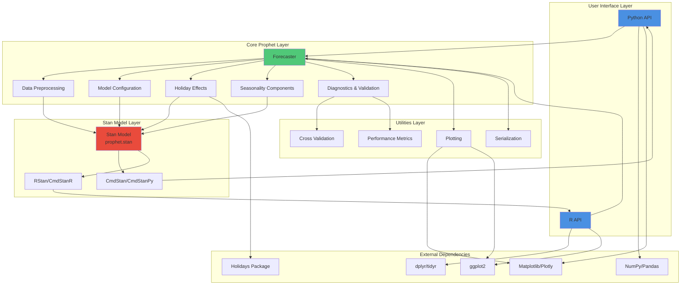
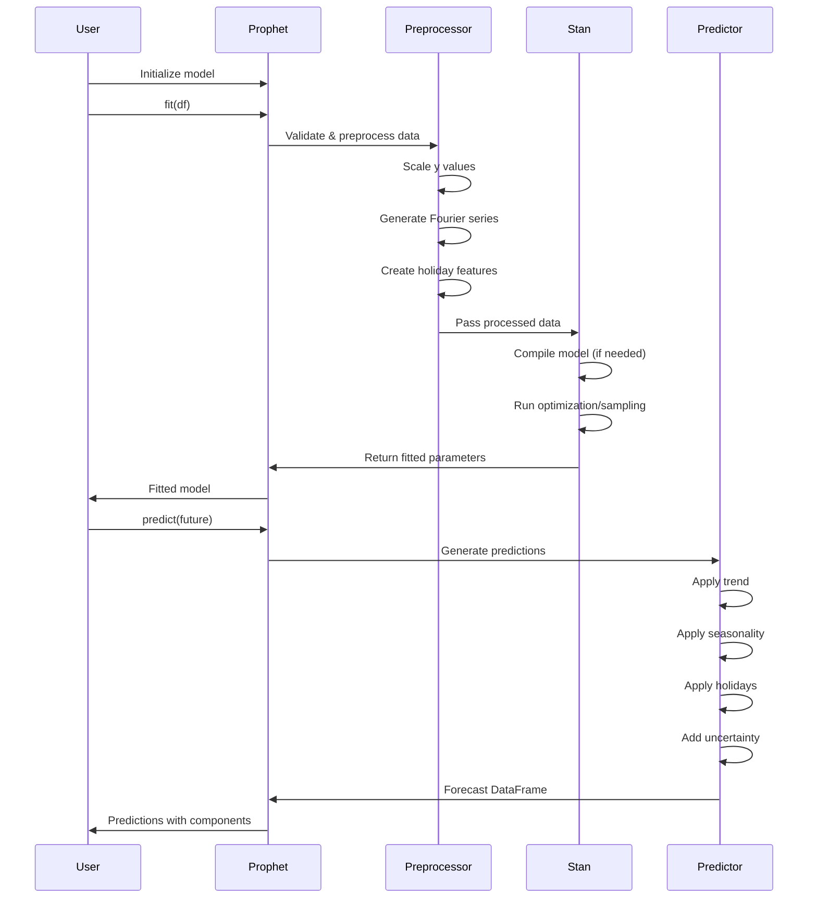

# Prophet Architecture

This document describes the architecture of the Prophet forecasting library, including its components, data flow, and key design decisions.

## Table of Contents

- [Overview](#overview)
- [System Architecture](#system-architecture)
- [Component Details](#component-details)
- [Data Flow](#data-flow)
- [Technology Stack](#technology-stack)
- [Design Decisions](#design-decisions)

## Overview

Prophet is a time series forecasting library available in both Python and R. It uses a decomposable additive model with three main components: trend, seasonality, and holidays. The core forecasting model is implemented in Stan, a probabilistic programming language for Bayesian inference.

## System Architecture



## Component Details

### 1. User Interface Layer

#### Python API (`python/prophet/`)
- **Entry Point**: `forecaster.py` - Main Prophet class
- **Purpose**: Provides Pythonic interface for time series forecasting
- **Key Features**:
  - Scikit-learn compatible API
  - DataFrame-based input/output
  - Numpy/Pandas integration

#### R API (`R/R/`)
- **Entry Point**: `R/prophet.R` - Main prophet function
- **Purpose**: Provides R interface for time series forecasting  
- **Key Features**:
  - Tidyverse-compatible API
  - R data.frame/tibble support
  - ggplot2 visualization

### 2. Core Prophet Layer

#### Forecaster (`python/prophet/forecaster.py`, `R/R/prophet.R`)
The main class/function that orchestrates the forecasting pipeline:
- Model initialization and configuration
- Data validation and preprocessing
- Model fitting via Stan
- Prediction generation
- Component extraction

**Key Methods/Functions**:
- `fit()` / `prophet()`: Fit the model to historical data
- `predict()`: Generate forecasts
- `make_future_dataframe()`: Create future dates for prediction
- `add_seasonality()`: Add custom seasonal components
- `add_regressor()`: Add additional regressors

#### Data Preprocessing (`forecaster.py`)
Transforms raw time series data into format required by Stan:
- Date/time parsing and validation
- Missing data handling
- Feature scaling (absmax or minmax)
- Fourier series generation for seasonality
- Regressor normalization

#### Model Configuration
Parameters that control model behavior:
- **Growth**: `linear`, `logistic`, or `flat`
- **Seasonality Mode**: `additive` or `multiplicative`
- **Changepoints**: Automatic or manual trend changepoints
- **Seasonality**: Enable/disable yearly, weekly, daily patterns
- **Holidays**: Country-specific or custom holiday effects

#### Holiday Effects (`make_holidays.py`)
Built-in holiday calendars for 100+ countries:
- Integration with `holidays` Python package
- Custom holiday support
- Holiday windows (before/after effects)
- Country-specific calendars

#### Seasonality Components
Fourier series-based seasonal modeling:
- **Yearly seasonality**: Default 10 Fourier terms
- **Weekly seasonality**: Default 3 Fourier terms  
- **Daily seasonality**: Default 4 Fourier terms
- **Custom seasonality**: User-defined periods

#### Diagnostics & Validation (`diagnostics.py`)
Model evaluation and validation tools:
- Time series cross-validation
- Performance metrics (MSE, RMSE, MAE, MAPE, coverage)
- Simulated historical forecasts
- Hyperparameter tuning support

### 3. Stan Model Layer

#### Stan Model (`python/stan/prophet.stan`, `R/inst/stan/prophet.stan`)
Core statistical model implemented in Stan:
- **Trend Component**: Piecewise linear or logistic growth
- **Seasonal Component**: Fourier series with priors
- **Holiday Component**: Indicator variables with priors
- **Regressor Component**: Linear effects with priors
- **Error Component**: Observation noise

**Mathematical Model**:
```
y(t) = g(t) + s(t) + h(t) + ε(t)
```
Where:
- `g(t)`: Trend (growth)
- `s(t)`: Seasonality  
- `h(t)`: Holiday effects
- `ε(t)`: Error term

#### CmdStan/CmdStanPy (Python Backend)
- Stan model compilation via CmdStan
- MCMC sampling or optimization (MAP estimation)
- Model binary packaging for distribution
- Cross-platform support (Linux, macOS, Windows)

#### RStan/CmdStanR (R Backend)
- Stan integration for R
- Support for both RStan and CmdStanR backends
- Parallel sampling support
- Warm start capabilities

### 4. Utilities Layer

#### Plotting (`plot.py`)
Visualization of forecasts and components:
- **Forecast plots**: Historical data + predictions + uncertainty
- **Component plots**: Separate trend, seasonality, holidays
- **Matplotlib backend**: Static plots
- **Plotly backend**: Interactive plots (Python)
- **ggplot2**: R plotting

#### Serialization (`serialize.py`)
Model persistence:
- JSON-based serialization format
- Save/load trained models
- Model versioning support
- Cross-language compatibility

#### Cross Validation (`diagnostics.py`)
Time series cross-validation:
- Rolling window validation
- Parallel execution support
- Cutoff date specification
- Performance metric calculation

#### Performance Metrics
Built-in evaluation metrics:
- MSE (Mean Squared Error)
- RMSE (Root Mean Squared Error)
- MAE (Mean Absolute Error)
- MAPE (Mean Absolute Percentage Error)
- Coverage (prediction interval coverage)

## Data Flow



## Technology Stack

### Python Implementation
- **Language**: Python 3.7+
- **Core Dependencies**:
  - `cmdstanpy`: Stan interface
  - `pandas`: Data manipulation
  - `numpy`: Numerical computing
  - `matplotlib`: Plotting
  - `holidays`: Holiday calendars
- **Optional Dependencies**:
  - `plotly`: Interactive plots
  - `dask`: Parallel cross-validation

### R Implementation
- **Language**: R 3.4+
- **Core Dependencies**:
  - `rstan` or `cmdstanr`: Stan interface
  - `dplyr`: Data manipulation
  - `ggplot2`: Plotting
  - `lubridate`: Date handling
- **Build System**:
  - `Rcpp`: C++ integration
  - `StanHeaders`: Stan C++ headers

### Stan Model
- **Language**: Stan (probabilistic programming)
- **Compiler**: CmdStan 2.33.1
- **Inference**: 
  - L-BFGS optimization (default)
  - MCMC sampling (optional)

### Build & Distribution
- **Python**: setuptools, wheel, PyPI
- **R**: R CMD build, CRAN
- **Docker**: Multi-stage builds
- **CI/CD**: GitHub Actions

## Design Decisions

### 1. Additive Model Design
**Decision**: Use additive components (trend + seasonality + holidays)

**Rationale**:
- Interpretable components
- Easy to adjust individual effects
- Supports multiplicative via log transform
- Aligns with domain expert intuition

### 2. Stan for Core Model
**Decision**: Implement core model in Stan

**Rationale**:
- Principled Bayesian inference
- Automatic uncertainty quantification
- Flexible prior specification
- Battle-tested MCMC implementation

**Trade-offs**:
- Longer compilation time
- Larger package size
- Additional dependency (C++ compiler)

### 3. Dual Language Support
**Decision**: Maintain both Python and R implementations

**Rationale**:
- Python: Popular in ML/engineering
- R: Popular in statistics/research
- Shared Stan model ensures consistency
- Broader user base

### 4. Default to Fast Optimization
**Decision**: Use MAP estimation (L-BFGS) by default, not full MCMC

**Rationale**:
- Much faster (seconds vs minutes)
- Sufficient for point predictions
- Users can opt-in to full Bayesian inference
- Better user experience for iteration

### 5. Automatic Seasonality Detection
**Decision**: Automatically enable relevant seasonalities based on data frequency

**Rationale**:
- Works out-of-box for most users
- Reduces configuration burden
- Can be overridden for custom cases
- Follows principle of sensible defaults

### 6. Fourier Series for Seasonality
**Decision**: Use Fourier series to model periodic patterns

**Rationale**:
- Flexible: capture complex patterns
- Compact: few parameters needed
- Smooth: continuous functions
- Fast: matrix multiplication

### 7. Dataframe-Based API
**Decision**: Input/output use dataframes with standardized column names ('ds', 'y')

**Rationale**:
- Consistent interface
- Clear data contracts
- Easy to integrate with data pipelines
- Familiar to data scientists

## Performance Characteristics

### Time Complexity
- **Model fitting**: O(NT²) where N = data points, T = changepoints
- **Prediction**: O(PF) where P = forecast periods, F = Fourier terms
- **Cross-validation**: O(K × fitting time) where K = number of folds

### Memory Usage
- **Model size**: ~1-10 MB (serialized)
- **Stan compilation**: ~500 MB temporary
- **Runtime**: Proportional to data size and uncertainty samples

### Scalability
- **Data points**: Tested up to 10+ years daily data (~4000 points)
- **Forecast horizon**: Any length (uncertainty grows with time)
- **Parallel**: Cross-validation parallelizable
- **Distributed**: Not directly supported

## Extension Points

Prophet provides several extension points for customization:

1. **Custom Seasonality**: Add domain-specific periodic patterns
2. **Additional Regressors**: Include external variables
3. **Custom Holidays**: Define special events
4. **Prior Tuning**: Adjust regularization strength
5. **Growth Models**: Implement custom trend functions
6. **Uncertainty**: Control prediction interval width

## Future Directions

Potential architectural improvements:

- **GPU acceleration**: For large-scale forecasting
- **Distributed training**: For multiple time series
- **AutoML integration**: Automated hyperparameter tuning
- **Real-time updates**: Incremental model updates
- **Model compression**: Smaller serialized models

## References

- **Prophet Paper**: Taylor & Letham (2018), "Forecasting at Scale"
- **Stan Documentation**: https://mc-stan.org/
- **GitHub Repository**: https://github.com/facebook/prophet
- **Project Documentation**: https://facebook.github.io/prophet/
